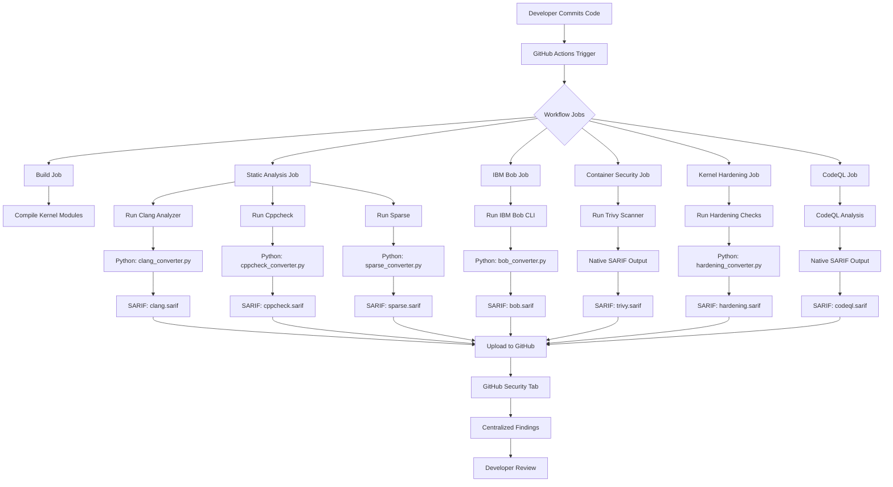
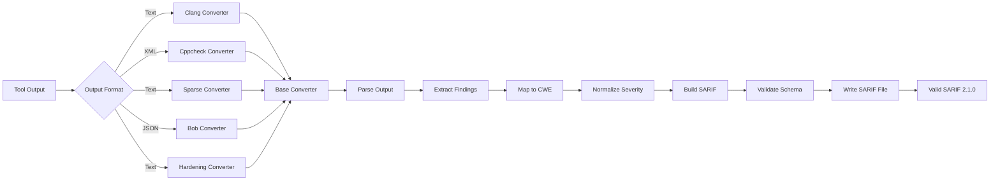
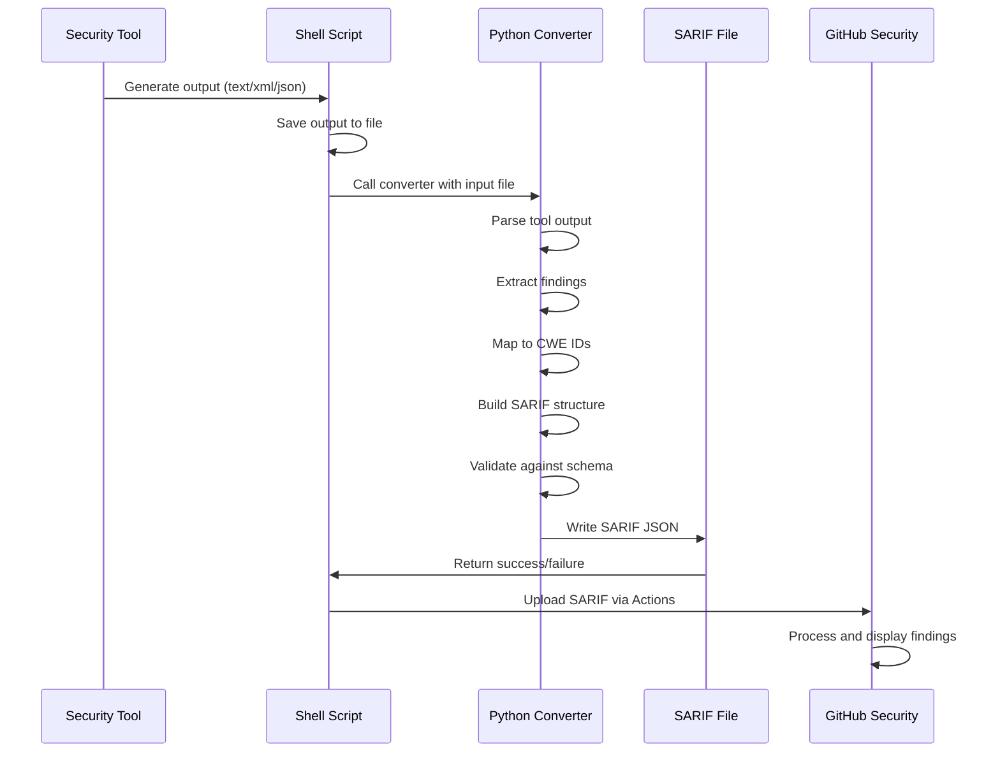
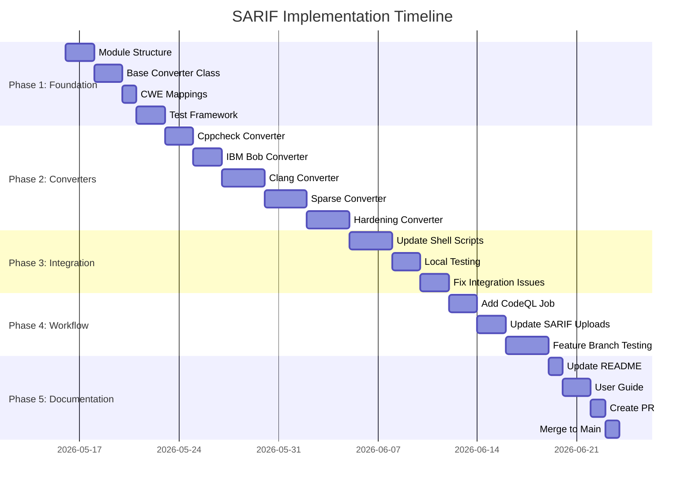
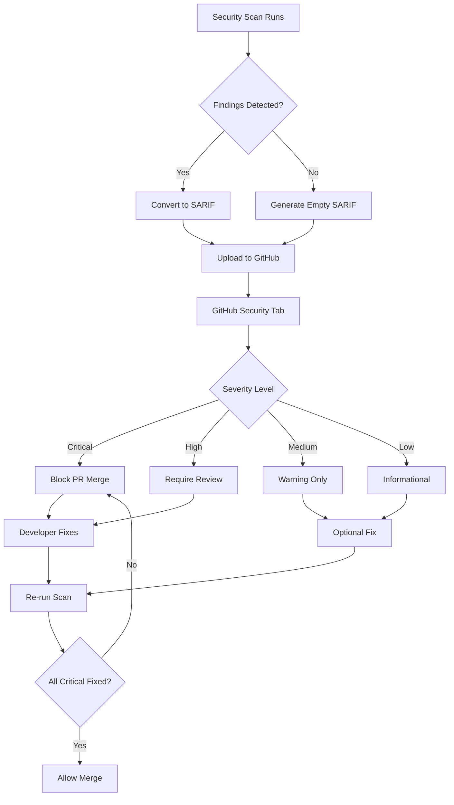
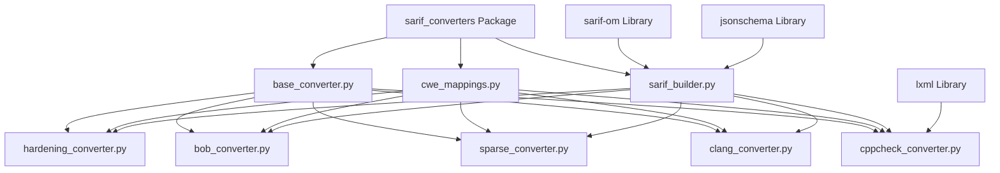
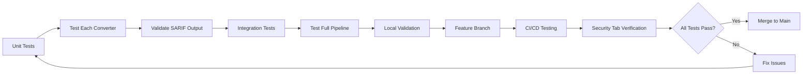
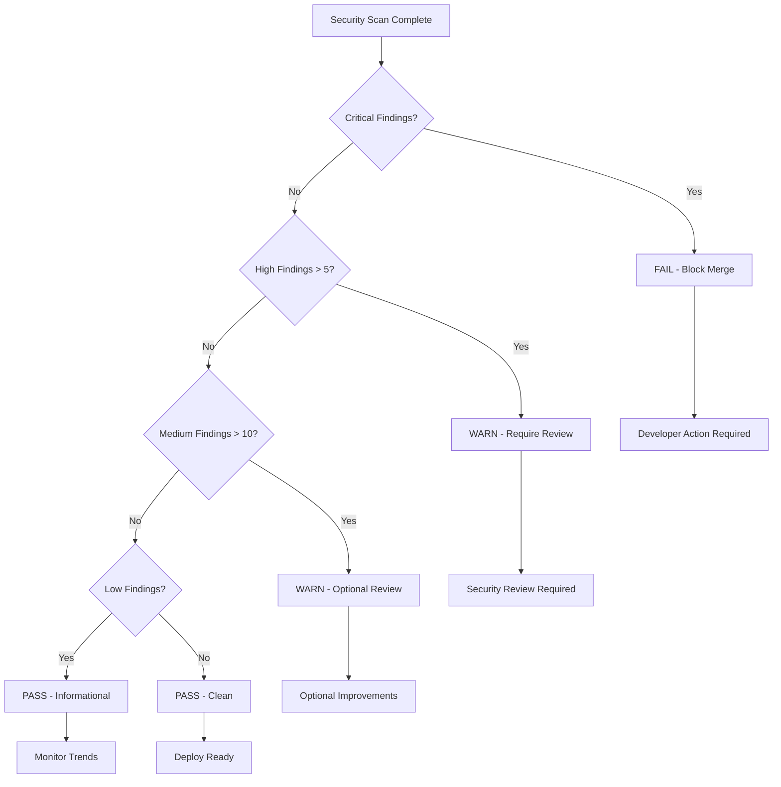
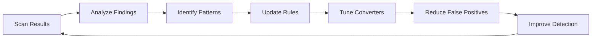

# SARIF Implementation Workflow Diagram
## Krynox Nexus - Visual Implementation Guide

---

## 🔄 Complete SARIF Pipeline Flow



---

## 🏗️ SARIF Converter Architecture



---

## 📊 Data Flow: Tool Output → SARIF



---

## 🔍 SARIF Structure Example

```json
{
  "$schema": "https://raw.githubusercontent.com/oasis-tcs/sarif-spec/master/Schemata/sarif-schema-2.1.0.json",
  "version": "2.1.0",
  "runs": [
    {
      "tool": {
        "driver": {
          "name": "Clang Static Analyzer",
          "version": "14.0.0",
          "informationUri": "https://clang-analyzer.llvm.org/",
          "rules": [
            {
              "id": "buffer-overflow",
              "name": "BufferOverflow",
              "shortDescription": {
                "text": "Buffer overflow detected"
              },
              "fullDescription": {
                "text": "Potential buffer overflow vulnerability"
              },
              "defaultConfiguration": {
                "level": "error"
              },
              "properties": {
                "tags": ["security", "memory-safety"],
                "precision": "high"
              },
              "relationships": [
                {
                  "target": {
                    "id": "CWE-120",
                    "toolComponent": {
                      "name": "CWE"
                    }
                  },
                  "kinds": ["superset"]
                }
              ]
            }
          ]
        }
      },
      "results": [
        {
          "ruleId": "buffer-overflow",
          "level": "error",
          "message": {
            "text": "Potential buffer overflow in strcpy call"
          },
          "locations": [
            {
              "physicalLocation": {
                "artifactLocation": {
                  "uri": "src/vulnerable/buffer_overflow.c",
                  "uriBaseId": "SRCROOT"
                },
                "region": {
                  "startLine": 45,
                  "startColumn": 5,
                  "endLine": 45,
                  "endColumn": 30,
                  "snippet": {
                    "text": "strcpy(buffer, user_input);"
                  }
                }
              }
            }
          ],
          "cweIds": [120],
          "properties": {
            "severity": "critical",
            "confidence": "high"
          }
        }
      ]
    }
  ]
}
```

---

## 🎯 Implementation Phases Timeline



---

## 🔐 Security Findings Flow



---

## 📦 Module Dependencies



---

## 🧪 Testing Strategy Flow



---

## 📊 Quality Gate Decision Tree



---

## 🔄 Continuous Improvement Loop



---

*These diagrams provide visual guidance for the SARIF implementation. Refer to [SARIF_IMPLEMENTATION_PLAN.md](./SARIF_IMPLEMENTATION_PLAN.md) for detailed specifications.*